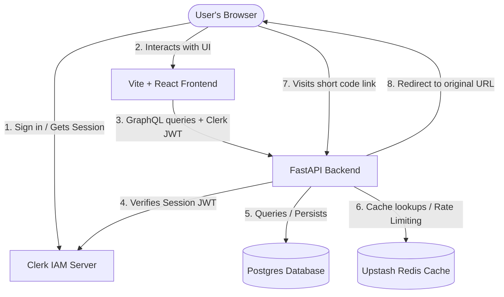

# TinyLink Architecture

This document details the system architecture and data flows of **TinyLink**, a production-grade SaaS URL shortener.

## System Overview

## Architectural Components

1. **Frontend Application (`/frontend`)**
   - **Framework:** React 19, TypeScript, Vite.
   - **State & Data Fetching:** Apollo Client for GraphQL middleware sync.
   - **Styling:** Vanilla TailwindCSS.
   - **Authentication:** Clerk React SDK. Transmits Clerk JWT Bearer tokens to backend.

2. **Backend Application (`/backend`)**
   - **Framework:** FastAPI (Python).
   - **GraphQL Engine:** Strawberry GraphQL for API endpoints with declarative schemas.
   - **ORM & DB Access:** SQLAlchemy accessing PostgreSQL database.
   - **Session Verification:** Verify Clerk ID token signatures via Clerk's public JWKS keys.
   - **Caching & Rate Limiting:** Redis container / Upstash Redis for quick short link analytics + redirection caching.

3. **External Services**
   - **Clerk:** Handles complete AuthN flow, user lifecycle callbacks, and session issuance.
   - **PostgreSQL Database:** Primary persistent store for users, short links, and raw redirect logs.
   - **Redis Cache:** Secondary cache storage for short link resolution (making redirection near O(1) latency) and rate limiting.

## Key Data Flows

### 1. User Sign-in & Authentication Flow
1. User authenticates on React client via Clerk widgets.
2. Clerk returns a session JWT to the client.
3. Every Apollo Client request attaches the JWT to the `Authorization: Bearer <TOKEN>` header.
4. FastAPI's custom Strawberry context handler `get_context()` detects the token and verifies it.
5. If the user session is verified but the user record doesn't exist in PostgreSQL, the backend auto-provisions they durably (`UserService.find_or_create()`).

### 2. URL Shortening Flow
1. User submits a URL on the Frontend.
2. Form schema validates input and calls the `createShortUrl` GraphQL mutation.
3. FastAPI backend validates URL sanity, generates a base58 hash alias / short code, saves the row to PostgreSQL, and indexes it in Upstash Redis cache.

### 3. Redirection Flow (Fast Redirection)
1. User navigates to `https://tinylink.io/<short_code>`.
2. Catch-all REST redirect router in FastAPI intercepts the path.
3. Fast lookup: Backend checks Redis for the mapping: `short_code` -> `original_url`.
4. Fallback: If not found in Redis, backend queries PostgreSQL database, then asynchronously populates Redis cache.
5. Tracking: Backend issues a 307 Temporary Redirect and schedules an background analytics log task to record click analytics (IP, device info, browser info).
